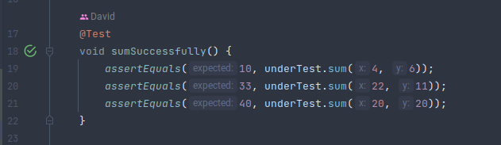
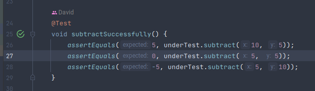
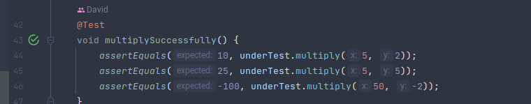
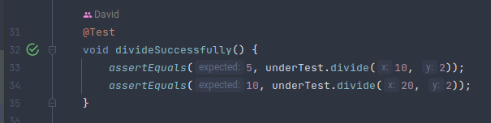
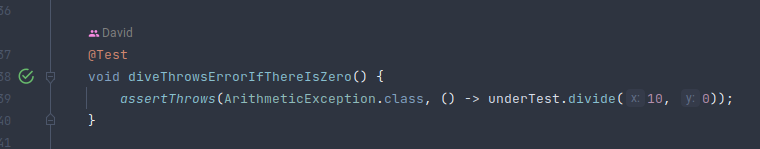
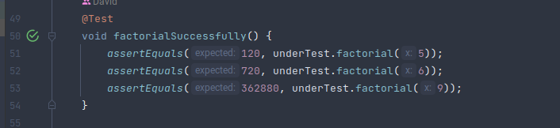

## Recursive Calculator
A simple calculator whose functions are based on recursion.

Calculator Class.
```java
public class Calculator {

    public Integer sum(Integer x, Integer y) {
        if (y == 0) {
            return x;
        } else {
            return (1 + sum(x, y - 1));
        }
    }

    public Integer subtract(Integer x, Integer y) {
        if (y == 0) {
            return x;
        } else {
            return subtract((x - 1), (y - 1));
        }
    }

    public Integer multiply(Integer x, Integer y) {
        if (y > 0) {
            return x + multiply(x, y - 1);
        } else if (y < 0) {
            return -x + multiply(x, y + 1);
        }
        return 0;
    }

    public Integer divide(Integer x, Integer y) {
        if (y == 0) {
            throw new ArithmeticException();
        } else if (x - y == 0) {
            return 1;
        } else if (x < y) {
            return 0;
        } else {
            return (1 + divide(x - y, y));
        }
    }

    public Integer factorial(Integer x) {
        if (x == 1 ){
            return 1;
        }
        return x * factorial(x - 1);
    }
}
```


Test
```java
class CalculatorTest {

    private Calculator underTest;

    @BeforeEach
    void setUp() {
        underTest = new Calculator();
    }

    @Test
    void sumSuccessfully() {
        assertEquals(10, underTest.sum(4, 6));
        assertEquals(33, underTest.sum(22, 11));
        assertEquals(40, underTest.sum(20, 20));
    }

    @Test
    void subtractSuccessfully() {
        assertEquals(5, underTest.subtract(10, 5));
        assertEquals(0, underTest.subtract(5, 5));
        assertEquals(-5, underTest.subtract(5, 10));
    }

    @Test
    void divideSuccessfully() {
        assertEquals(5, underTest.divide(10, 2));
        assertEquals(10, underTest.divide(20, 2));
    }

    @Test
    void diveThrowsErrorIfThereIsZero() {
        assertThrows(ArithmeticException.class, () -> underTest.divide(10, 0));
    }

    @Test
    void multiplySuccessfully() {
        assertEquals(10, underTest.multiply(5, 2));
        assertEquals(25, underTest.multiply(5, 5));
        assertEquals(-100, underTest.multiply(50, -2));
    }

    @Test
    void factorialSuccessfully() {
        assertEquals(120, underTest.factorial(5));
        assertEquals(720, underTest.factorial(6));
        assertEquals(362880, underTest.factorial(9));
    }


}
```
All test are passing:






